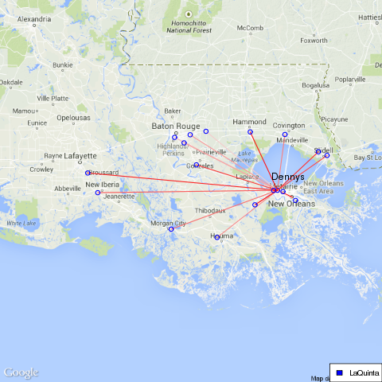

#Introduction
According to the late comedian, Mitch Hedberg, "La Quinta is Spanish for next to Denny’s". In order to assess this claim, John Reiser scraped the location data for all US locations of La Quinta hotels and Denny's restaurants and applied certain analyses on the scraped data. 


##Scraping the data
We separated the data mining into sections of downloading and parsing for both the La Quinta and Denny's datasets. 

###La Quinta Data Download
In order to get the La Quinta data, we searched through the website to find the page with the most information. We found that the most data could be found using the interactive map on their find a hotel page (http://www.lq.com/en/findandbook.html). After noticing that parts of the html page contain chunks of XML code, we downloaded the content from this url, and separated these chunks out for each individual hotel. By searching for the regular expression starting with "hotelList.push", we were able to break the content up for each hotel. After converting the XML chunks into dataframes, we were able to find the Title, InnNumber, Latitude, Longitude, ImagePath, isInnAndSuites, street, street2, city, stateProv, postalCode, and countryDisplay for every La Quinta hotel in the United States, Mexico, and Canada.

We took our parsing one step further in order to get the phone and fax numbers for each individual hotel. All of the hotels have their own inn number, which we could then use to go to each specific hotel webpage. We scraped each of these individual webpages, and then split each page to find both of these numbers. Surprisingly, many of the hotels listed on La Quinta's site do not have their own sites, despite having links to them, and instead direct you back to the La Quinta Inn & Suites Chicago Downtown location. Thus, many of the points have the same phone and fax numbers. 

### Denny's Data Download
We downloaded denny's data using the same method described in John Reiser's blog. In the blog, he downloads the data for the continental US by using Washington, DC and Salt Lake City, UT as centers of two search radius. To obtain complete list of Denny's restaurants we added three more locations, Fairbanks, AK, Kahului, HI and Thompson, MB. We were able to get locations in Alaska, Hawaii and all of Canada using these locations.
We parsed the required information on all Denny's location including latitude and longitude, address and phone number from the downloaded XML files. We then removed Denny's locations in Dominican Republic and Puerto Rico as there are no La Quintas in those locations.

###Data Analysis
We initially tried to check the validity of the comedians claim by furthering Reiser's analysis and comparing the number of Denny's and La Quinta establishments that are within 100 and 150 meters of each other. We got 29 that are within 100m of each other, which is the same as what was found by John Reiser. As for within 150m, we got 50 which is 1 more than Mitch got. This can be accounted for by the newly established locations.
```{r load data, echo=FALSE}
# source("check_packages.R")
# check_packages(c("data.table", "xtable"))
load("Data/analysis.Rdata")

verify.data <- data.frame("Within 100m"=length(all.df$distanceKm[all.df$distanceKm<=.1]), "Within 150m"=length(all.df$distanceKm[all.df$distanceKm<=.15]))
c("within 100m:", length(all.df$distanceKm[all.df$distanceKm<=.1]),  "Within 150m:", length(all.df$distanceKm[all.df$distanceKm<=.15])) 

```


###Create a histogram

We created a histogram that shows total number of Denny's-La Quinta combinations that are within certain distances of each other. We excluded the combination where the nearest one is more than 25 miles away.
```{r, create histogram, echo=FALSE, fig.align='center'}

par(mar=c(4,4,4,1) + 0.1)
hist(all.df$distanceMiles[all.df$distanceMiles<=25], breaks = 100,
     main = "Number of Denny's at certain distance of a La Quinta",
     xlab = "Distance", ylab= "Number of Denny's")
```


###Distances
Here we look at the cumulative percentage of combinations within certain distance. We also see that 90% of the time there will be a Denny's within 40 miles of a La Quinta.
```{r, echo=FALSE, fig.align='center'}

sortedDistance= sort(all.df$distanceMiles)
CDF <- NULL
vertical=NULL
for (i in 1:200){
  CDF[i] <- length(sortedDistance[sortedDistance<=i])/length(sortedDistance)
  if (CDF[i]>=.9){
    vertical <- c(vertical,i)
  }
}
par(mar=c(4,5,4,1) + 0.1)
plot(1:length(CDF), CDF, type ="l", xlab= "Distance between Dennys and LQ", ylab="Cumulitive percentage within the distance")


abline(v = vertical[1], col="red" )
vertical[1]

```
###Map
<div style="text-align:center">

</div>
