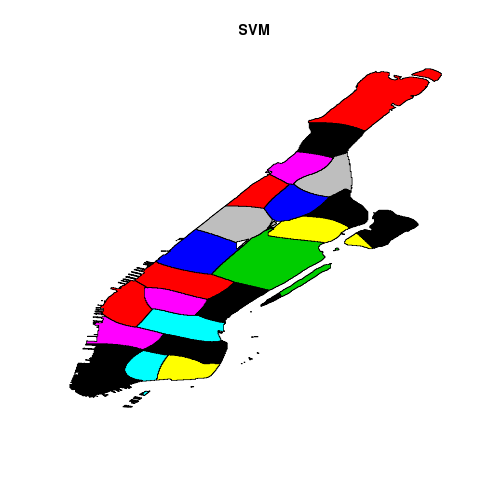

### Geocoding
In order to efficiently geocode, we had to match observations from the data of `NYParkingViolations.csv` and `MNMapPLUTO`. This entailed standardizing nomenclature, for example, ensuring that "street" was denoted as "st," "1st" as "1", "drive" as "dr" etc. in both sets. We began this process of string replacement using `stringr` on a subset of the full `NYParkingViolations.csv` data for proof-of-concept testing and to improve run-times while tuning our methodology. Once satisfied with the number of matches we achieved with the subset, we applied our transformations to the full `NYParkingViolations.csv` data set. 

Loading the data from `NYParkingViolations.csv` into R was made simpler by Dr. Rundel's code utilizing the `dplyr` package that provided useful functions for trimming excess whitespace from entries, removing blanks, ensuring house numbers only consisted of numbers, and that addresses were all lower case. 

After loading the unpolished data from `NYParkingViolations.csv` using Dr. Rundel's example code, creating subsets of the filtered and cleaned data, we matched the addresses from our data frame `addr` built from `NYParkingViolations.csv`, and `tax` built from `MNMapPLUTO` using the `inner_join` function then stored the results in variable `z`. This was further subsetted to only include `Violation Precincts` matching Manhattan's actual police precinct numbers as given by the following website http://unhp.org/crg/indy-maps_police_mn.html. It was necessary to specify the police precints since we loaded data including extraneous precincts, specifically all precincts numbering between 0 and 34 when only 22 of that set are actually in Manhattan. After storing this subset in `z.sub`, another subset was stored as `z.final` with only the latitudes and longitudes for a given precinct within the 0.005 and 0.995 quantiles, effectively discarding extreme outliers within the 0.5% tails. We further elaborate on each of our preceding geocoding approaches below.

### Recreating police Precincts

To recreate the police precincts, our first approach was using convex hulls of data obtained from geocoding the parking violations data. We had to remove outliers first before we could use convex hulls to get the boundaries of the precincts. We removed the outliers by checking if a point lied with certain inner percentile of another precinct and rejecting it if it did. We started with inner 30th percentile and incrementally got to 98th percentile removing outliers after each iteration. We were not able to properly implement two-dimensional quantiles and ended up using one dimensional quantiles for latitude and longitude. This resulted in a few rectangular precincts instead of their actual shapes.

We scrapped that idea because using SVM was getting us much better result right away.
We still needed to clear some outliers to get better results. First, we removed outliers which were not within the inner 99% interval for each precinct. Second, we apply svm methods to find the best model. We used a small percentage of data to tune the parameters of SVM model. The computation time for tuning was really high. With just 3 options each for two parameters, and about 2% of data it took about 90 minutes for the tuning. So, instead we took the best parameter values we got from a couple of tuning runs and used those in SVM modelling. So, we were able to use more data in the modelling. After this adjustment we were able to increase the testing data from 2% to 6.67% and still keep the total runtime under the 2 hour limit.

While running the SVM model, we encountered a problem with precinct 22(Central Park). When we looked at the data for 22nd precinct more closely, we found that none of the points were actually inside Central Park. Most of them were on the boundary with a few outliers sitting inside other precincts.

To counter this problem, we decided to use the data we have on 22nd precinct and use it to generate points inside Central Park. First, we removed most of the outliers and were left mostly with data on the border of 22nd precinct. Then, we randomly generated slightly skewed data inside the bound of remaining 22nd precinct data using gamma distribution on both latitude and longitude. We then added assigned all of these points to precinct 22 and added them to the data set used on SVM modelling.

Next, we needed to use the prediction model we had on the map of Manhattan. To accomplish this, we used the NYC borough boundary shapefile. We created a raster using the Manhattan shapefile. Then we predicted the precinct of each coordinate within Manhattan using the model we had derived earlier. The figure below shows our prediction of the Manhattan police precincts.

